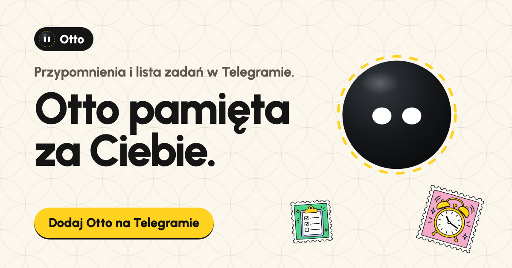

<p align="center">
  
</p>

<p align="center">
  <a href="https://t.me/HiOttoBot"></a>
  &nbsp;
  <a href="https://otto.designhouse.me"></a>
</p>

<p align="center">
  
  
  
  
  
  
</p>

<p align="center">
  
</p>

## Cześć, jestem Otto

Jestem czarną kulką z dwoma oczami (to te dwa „O” w moim imieniu) i mieszkam w Telegramie. Piszesz do mnie jak do znajomego, na przykład „jutro o 9 przypomnij mi o fakturze”, a ja odpisuję jak znajomy i jutro o 9:00 przypominam, odpowiadając na Twoją wiadomość. Prowadzę też Twoją listę zadań, przypiętą u góry czatu. Na początku pytam, jak mam się do Ciebie zwracać i jak pisać (możesz pominąć).

Zawsze będę za darmo, a mój kod jest otwarty: patrzysz właśnie na niego.

Nie zapisuję, co piszesz. Przypomnienie to dla mnie numer wiadomości i godzina, a lista to wiadomość w Twoim Telegramie. Każdy ma swojego Otta: nie jestem botem do grup.

<p align="center">
  
  &nbsp;&nbsp;
  
</p>

## Co umiem

<table>
  <tr>
    <td width="96"></td>
    <td><b>Przypominam o każdej wiadomości.</b> Także o zdjęciu paragonu albo głosówce: odpowiedz na nią <code>/przypomnij jutro o 9</code>. Gdy przyjdzie pora, mam drzemkę „+15 min” i „Zrobione”.</td>
  </tr>
  <tr>
    <td></td>
    <td><b>Komendy rozumieją terminy bez żadnego AI.</b> <code>/przypomnij jutro o 9 faktura</code>, „w piątek 15:30”, „za 2 h”, „12.10 o 8”, „za tydzień”, „jutro wieczorem”. Także zmianę czasu w październiku.</td>
  </tr>
  <tr>
    <td></td>
    <td><b>Trzymam jedną listę.</b> <code>/dodaj mleko, chleb</code> i lista jest przypięta u góry czatu. Zrobione? Klikasz numer i znika.</td>
  </tr>
  <tr>
    <td></td>
    <td><b>Rozmawiam jak znajomy.</b> Każde konto dostaje ode mnie 10 wiadomości AI na start, bez maila i rejestracji: „po pracy przypomnij mi o oponach” i już. Potem działam na komendach, zawsze za darmo.</td>
  </tr>
  <tr>
    <td></td>
    <td><b>Z Twoim kluczem gadam bez limitu.</b> Gemini (najprościej darmowy klucz z Google AI Studio), OpenAI, Anthropic albo OpenRouter. Wiadomość z kluczem kasuję od razu, a klucz trzymam zaszyfrowany.</td>
  </tr>
</table>

## Ile kosztuję

| Poziom | Co daje |
|---|---|
|  **Zawsze za darmo** | przypomnienia, lista i komendy typu `/przypomnij jutro o 9`, bez limitu |
|  **10 wiadomości AI na start** | raz na konto Telegrama, bez maila i rejestracji |
|  **Własny klucz** | AI bez limitu; za użycie płacisz dostawcy klucza, nie nam |
|  **Abonament** | wiadomości AI bez limitu, bez klucza i bez konfiguracji; [napisz do Design House](https://designhouse.me/kontakt) (robią też boty dla zespołów) |

## Co o Tobie wiem

Mniej, niż myślisz. Po lewej cała moja karta o Tobie, po prawej to, co zostaje tylko w Twoim Telegramie.

<p align="center"></p>

| Zapisuję | Nie zapisuję |
|---|---|
| numer czatu i strefę czasową | treści wiadomości ani historii rozmów |
| licznik darmowych wiadomości AI | listy zadań (to przypięta wiadomość w Telegramie) |
| przypomnienia jako numer wiadomości i godzinę, do chwili wysłania | nazwy użytkownika ani zdjęć |
| klucz API, zaszyfrowany (AES-GCM), jeśli go podasz | maili ani numerów telefonów |
| jak mam się do Ciebie zwracać i jak pisać, jeśli sam podasz | imienia z profilu Telegrama |
| hash numeru czatu, żeby darmowe wiadomości były raz na konto | |

Gdy używam AI, treść wiadomości trafia do dostawcy modelu. Telegram nie szyfruje rozmów z botami end-to-end. `/zapomnij` usuwa wszystko, co mam, poza hashem numeru czatu (bez niego darmowe wiadomości dałoby się odnawiać).

## Komendy

```text
/lista                Twoja lista, przypięta u góry czatu
/dodaj mleko, chleb   dopisuje do listy
/przypomnij jutro o 9 przypomnienie (działa też w odpowiedzi na dowolną wiadomość)
/przypomnienia        co i kiedy przypomnę
/klucz                własny klucz AI, bez limitu (/model zmienia model)
/ustawienia           jak mam się do Ciebie zwracać i jak pisać
/strefa               strefa czasowa
/id                   Twój numer konta, np. dla testerów
/pomoc                co umiem i ile masz wiadomości
/zapomnij             usuwam Twoje dane
```

## Na stronie można mną rzucać

Na [otto.designhouse.me](https://otto.designhouse.me) złap mnie w hero i rzuć: odbijam się od ścian jak piłka, toczę się, wołam „Juhuuu!” i wracam na miejsce. Ten mniejszy ja w rogu ekranu odpowiada na pytania o mnie (przez Gemini Flash, a bez sieci gotowymi tekstami).

## Testerzy i VIP-y

Wyślij mi `/id`, a dostaniesz swój numer konta z przyciskiem do skopiowania. Admin (numer w sekrecie `ADMIN_CHAT_IDS`) daje w czacie ze mną `/vip NUMER` (AI bez limitu), `/vip NUMER 50` (50 wiadomości więcej) albo `/unvip NUMER`. Samo `/vip` pokazuje listę. Daję znać każdemu, kto dostał więcej, a dzienny bezpiecznik kosztów pilnuje też VIP-ów.

<details>
<summary><b>Własny Otto: instalacja i rozwój (dla programistów)</b></summary>

### Czego potrzebujesz

Konta Cloudflare (Workers i Durable Objects działają w planie darmowym), Node.js 22+ i bota od [@BotFather](https://t.me/BotFather). Klucz Gemini (darmowe wiadomości i rozmowa na stronie) jest opcjonalny: bez niego działa tryb ręczny i własne klucze użytkowników.

### Lokalnie

```bash
npm install
cp .dev.vars.example .dev.vars    # DEV_DRY_RUN=1: nic nie wychodzi do Telegrama
npm run dev                       # http://localhost:8787
```

W trybie `DEV_DRY_RUN` wywołania Telegrama lądują w konsoli. Test dymny przechodzi całego bota (darmowe wiadomości, tryb ręczny, lista, przypomnienie z alarmem, klucz, VIP, `/zapomnij`) zmyślonymi aktualizacjami z Telegrama. Uzupełnij w `.dev.vars` wartości testowe (`TELEGRAM_WEBHOOK_SECRET=dev-secret`, `ADMIN_TOKEN=dev-admin`, `BOT_USERNAME=otto_dev_bot`, `ADMIN_CHAT_IDS=777000`, `KEY_SECRET`, `HASH_PEPPER`, dowolny `GEMINI_API_KEY`), a potem:

```bash
npm run dev > dev.log 2>&1 &
npm run smoke -- dev.log
```

### Na Cloudflare

```bash
npx wrangler deploy
npx wrangler secret put TELEGRAM_BOT_TOKEN       # od @BotFather
npx wrangler secret put BOT_USERNAME             # nazwa bota bez @
npx wrangler secret put TELEGRAM_WEBHOOK_SECRET  # długi losowy ciąg
npx wrangler secret put KEY_SECRET               # długi losowy ciąg, raz na zawsze
npx wrangler secret put HASH_PEPPER              # długi losowy ciąg, raz na zawsze
npx wrangler secret put ADMIN_TOKEN              # długi losowy ciąg
npx wrangler secret put ADMIN_CHAT_IDS           # numery kont adminów po przecinku (numer daje /id w bocie)
npx wrangler secret put GEMINI_API_KEY           # opcjonalnie

curl -X POST https://TWOJ-ADRES/admin/setup -H "Authorization: Bearer ADMIN_TOKEN"
```

`/admin/setup` ustawia webhook, komendy, opisy i zdjęcie profilowe bota, a adminom dodatkowe komendy w menu. Naklejki z sześcioma minami Otta zakłada `POST /admin/stickers`, a do tego potrzeba `STICKER_OWNER_ID`, czyli numeru konta Telegram właściciela zestawu.

Ustawienia bez tajemnic (model Gemini i zapasowy, liczba darmowych wiadomości, dzienne bezpieczniki kosztów, strefa domyślna) są w `wrangler.jsonc`. Tam jest też własna domena (`routes`): u siebie wpisz swoją, ze strefy na tym samym koncie Cloudflare, albo usuń wpis, a Otto będzie działał pod adresem `workers.dev`.

### Przed startem

1. **`KEY_SECRET` i `HASH_PEPPER` ustaw raz.** Zmiana `KEY_SECRET` unieważnia zapisane klucze użytkowników, a zmiana `HASH_PEPPER` zeruje pamięć o tym, które konta odebrały darmowe wiadomości.
2. **Polityka prywatności:** strona ma sekcję „Co Otto o Tobie wie”, ale publiczny bot potrzebuje też pełnej polityki (administrator danych, podstawa prawna, okresy przechowywania).
3. **Koszty:** `DAILY_FREE_LIMIT` i `SITE_DAILY_LIMIT` to dzienne bezpieczniki darmowych wiadomości w bocie i na stronie.

### Rozwój

```bash
npm test           # parser terminów, lista, klucze, szyfrowanie, odpowiedzi modelu
npm run typecheck
npm run assets     # naklejki, avatar, ikony i ilustracje WebP
```

Film o Otcie powstał z kodu skillem motion-design: źródło w [design/film/](design/film/), podgląd na żywo po otwarciu `design/film/index.html`, render przez `node render.mjs --src index.html --out film.mp4` w tym folderze (potrzeba Node 22+, ffmpeg i Chrome).

Jak to jest zbudowane: [docs/techniczne.md](docs/techniczne.md). Decyzje projektowe strony: [docs/strona.md](docs/strona.md). Ilustracje generuje Codex według [design/codex-ilustracje.md](design/codex-ilustracje.md). Grafiki do tego README to zrzuty prawdziwej strony (`docs/readme/`).

</details>

## Licencja

Kod: [Apache-2.0](LICENSE). Wyjątki i elementy cudze są w [NOTICE](NOTICE): font Urbanist (SIL OFL 1.1), Motion (MIT), generator kodów QR (MIT), logo Telegrama. Postać Otta oraz nazwa i znak Design House nie są objęte licencją.

<p align="center">
  <a href="https://designhouse.me"></a>
</p>
