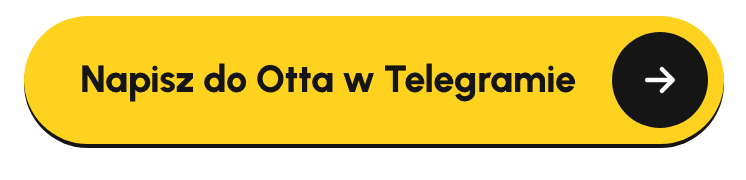
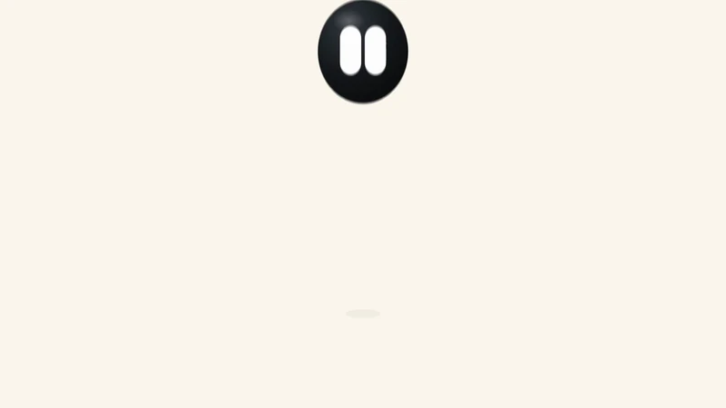
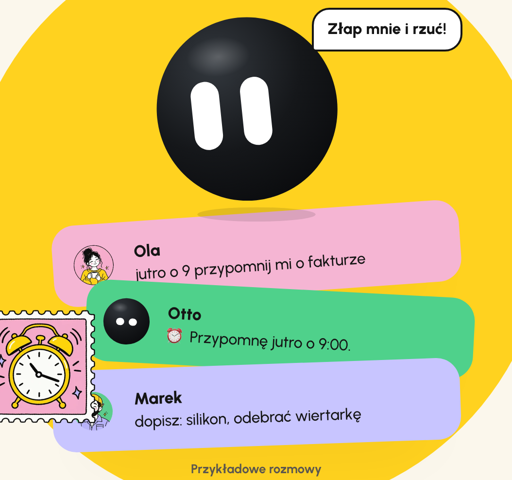
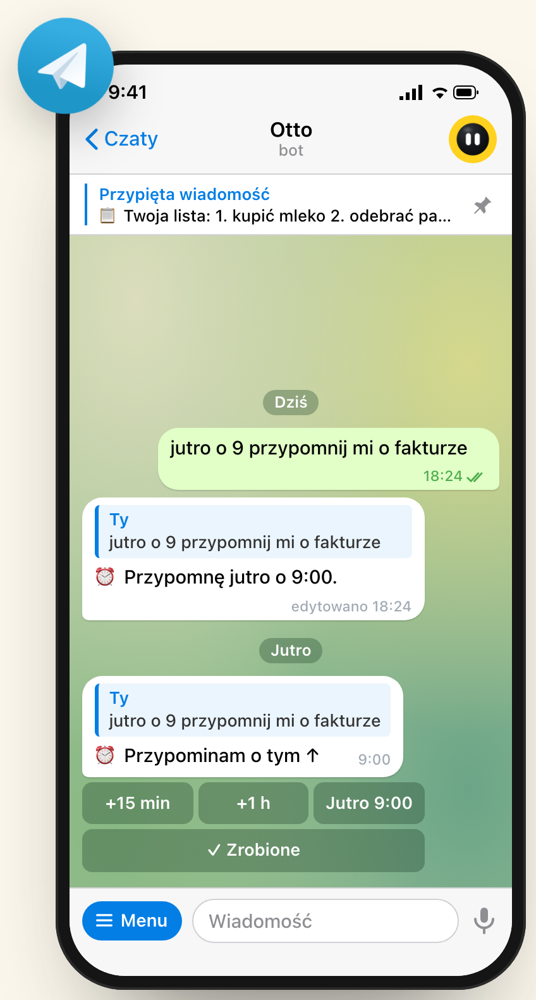
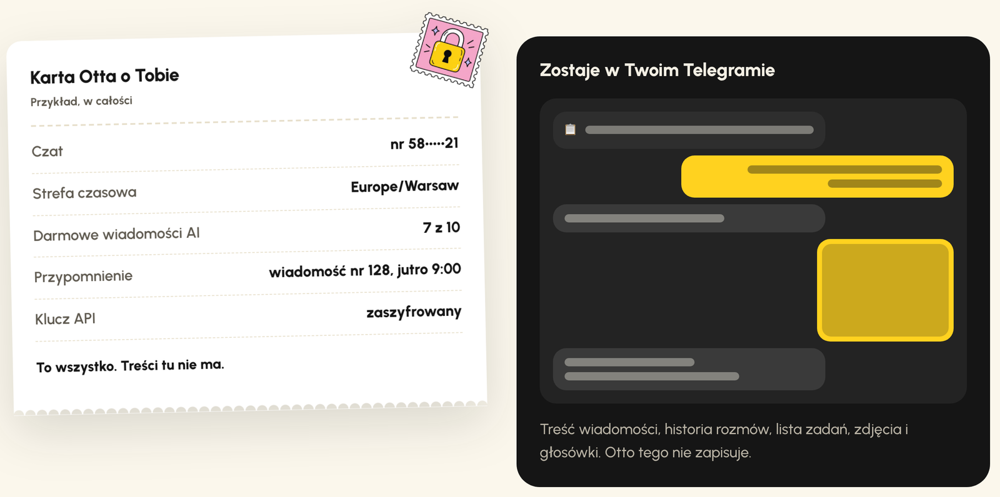

<p align="center">
  <a href="https://designhouse.me"><picture>
    <source media="(prefers-color-scheme: dark)" srcset="docs/readme/design-house-white.svg">
    
  </picture></a>
</p>

<h1 align="center">Otto</h1>

<p align="center"><b>Osobisty asystent w Telegramie.</b> Przypomina o czasie, trzyma listę zadań i rozmawia jak znajomy.</p>

<p align="center">
  <a href="https://t.me/HiOttoBot"></a>
  &nbsp;
  <a href="https://otto.designhouse.me"></a>
</p>

<p align="center">
  
</p>

## Cześć, jestem Otto

Czarna kulka z dwoma oczami (to te dwa „O” w moim imieniu). Mieszkam w Telegramie i każdy ma swojego Otta: rozmawiam tylko na czatach prywatnych, nie w grupach.

Piszesz do mnie jak do znajomego, na przykład „jutro o 9 przypomnij mi o fakturze”. Jutro o 9:00 odpowiadam na tę wiadomość, więc od razu widać, o co chodziło. Przy pierwszym `/start` pytam, jak mam się do Ciebie zwracać, w jakim stylu rozmawiać (serdecznie, rzeczowo, neutralnie albo na luzie) i do czego mam się przydać. Każde pytanie można pominąć. Godziny liczę w polskiej strefie, a za granicą zmienisz ją przez `/strefa`.

<p align="center">
  
</p>

Na powitanie wysyłam naklejkę. Cały [zestaw moich min](https://t.me/addstickers/otto_by_HiOttoBot) możesz dodać do swojego Telegrama, a na [stronie](https://otto.designhouse.me) można mną rzucać.

<p align="center">
  
  
  
  
  
  
</p>

## Co umiem

<table>
  <tr>
    <td width="96"></td>
    <td><b>Przypominam o każdej wiadomości.</b> Także o zdjęciu paragonu albo głosówce: odpowiedz na nią <code>/przypomnij jutro o 9</code>. Gdy przyjdzie pora, pod przypomnieniem są przyciski „+15 min”, „+1 h”, „Jutro 9:00” i „Zrobione”.</td>
  </tr>
  <tr>
    <td></td>
    <td><b>Rozumiem terminy bez AI.</b> „jutro o 9”, „w piątek 15:30”, „za 2 h”, „12.10 o 8”, „za tydzień”, „jutro wieczorem”. Uwzględniam też zmianę czasu.</td>
  </tr>
  <tr>
    <td></td>
    <td><b>Trzymam jedną listę zadań,</b> przypiętą u góry czatu. <code>/dodaj mleko, chleb</code> dopisuje, a zrobione odhaczasz przyciskiem z numerem.</td>
  </tr>
  <tr>
    <td></td>
    <td><b>Rozmawiam, słucham i patrzę.</b> „po pracy przypomnij mi o oponach” wystarczy, żebym sam ustawił przypomnienie albo dopisał coś do listy. Możesz też nagrać głosówkę albo wysłać zdjęcie, np. faktury z podpisem „przypomnij dzień przed terminem”.</td>
  </tr>
</table>

<p align="center">
  
</p>

## Za darmo, z kluczem albo w abonamencie

<table>
  <tr>
    <td width="96"></td>
    <td><b>Zawsze za darmo.</b> Przypomnienia, lista i komendy, bez limitu.</td>
  </tr>
  <tr>
    <td></td>
    <td><b>10 wiadomości AI na start.</b> Raz na konto Telegrama, bez maila i bez rejestracji.</td>
  </tr>
  <tr>
    <td></td>
    <td><b>Własny klucz (<code>/klucz</code>).</b> Rozmowa bez limitu z Gemini (najprościej darmowy klucz z Google AI Studio), OpenAI, Anthropic albo OpenRouter. Za użycie płacisz dostawcy klucza, nie nam. Wiadomość z kluczem kasuję od razu, a klucz trzymam zaszyfrowany. Zdjęcia rozumiem z każdym kluczem, głosówki z Gemini, OpenAI albo OpenRouter (gdy wybrany model przyjmuje dźwięk).</td>
  </tr>
  <tr>
    <td></td>
    <td><b>Abonament.</b> Rozmowa bez limitu, bez klucza i bez konfiguracji. <a href="https://designhouse.me/kontakt">Napisz do Design House</a>: robią też boty dla całych zespołów.</td>
  </tr>
</table>

## Co o Tobie wiem

Mniej, niż myślisz. Po lewej cała moja karta o Tobie, po prawej to, co zostaje tylko w Twoim Telegramie.

<p align="center">
  
</p>

| Zapisuję | Nie zapisuję |
|---|---|
| numer czatu i strefę czasową | treści wiadomości ani historii rozmów |
| licznik darmowych wiadomości AI | listy zadań (to przypięta wiadomość w Telegramie) |
| przypomnienia jako numer wiadomości i godzinę, do chwili wysłania | nazwy użytkownika ani zdjęć |
| klucz API, zaszyfrowany (AES-GCM), jeśli go podasz | maili ani numerów telefonów |
| jak mam się do Ciebie zwracać i w jakim stylu, jeśli podasz | imienia z profilu Telegrama |
| hash numeru czatu, żeby darmowe wiadomości były raz na konto | |

Gdy używam AI, treść wiadomości (także zdjęć i głosówek) trafia do dostawcy modelu. Plików nie zapisuję: pobieram je z Telegrama tylko na czas jednej odpowiedzi. Telegram nie szyfruje rozmów z botami end-to-end. `/zapomnij` usuwa wszystko, co mam, poza hashem numeru czatu (bez niego darmowe wiadomości dałoby się odnawiać).

## Komendy

```text
/lista                Twoja lista, przypięta u góry czatu
/dodaj mleko, chleb   dopisuje do listy
/przypomnij jutro o 9 przypomnienie (działa też w odpowiedzi na dowolną wiadomość)
/przypomnienia        co i kiedy przypomnę
/klucz                własny klucz AI, bez limitu (/model zmienia model)
/ustawienia           jak mam się do Ciebie zwracać i w jakim stylu
/strefa               strefa czasowa
/id                   Twój numer konta, np. dla testerów
/pomoc                co umiem i ile masz wiadomości
/zapomnij             usuwam Twoje dane
```

## Własny Otto

Otto działa na Cloudflare Workers i Durable Objects (z ich wbudowanym SQLite), bez frameworka i bez osobnej bazy danych. Jak jest zbudowany, opisuje [docs/techniczne.md](docs/techniczne.md).

<details>
<summary><b>Uruchomienie lokalnie</b></summary>

Potrzebujesz Node.js 22+, a do wdrożenia konta Cloudflare (Workers i Durable Objects działają w planie darmowym) i bota od [@BotFather](https://t.me/BotFather).

```bash
npm install
cp .dev.vars.example .dev.vars    # DEV_DRY_RUN=1: nic nie wychodzi do Telegrama
npm run dev                       # http://localhost:8787
```

W trybie `DEV_DRY_RUN` wywołania Telegrama lądują w konsoli. Test dymny przechodzi całego bota (darmowe wiadomości, tryb komend, lista, przypomnienie z alarmem, klucz, VIP, `/zapomnij`) zmyślonymi aktualizacjami z Telegrama. Uzupełnij w `.dev.vars` wartości testowe (`TELEGRAM_WEBHOOK_SECRET=dev-secret`, `ADMIN_TOKEN=dev-admin`, `BOT_USERNAME=otto_dev_bot`, `ADMIN_CHAT_IDS=777000`, `KEY_SECRET`, `HASH_PEPPER`, dowolny `GEMINI_API_KEY`), a potem:

```bash
npm run dev > dev.log 2>&1 &
npm run smoke -- dev.log
npm test           # parser terminów, lista, klucze, szyfrowanie, odpowiedzi modelu
npm run typecheck
```

</details>

<details>
<summary><b>Wdrożenie na Cloudflare</b></summary>

```bash
npx wrangler deploy
npx wrangler secret put TELEGRAM_BOT_TOKEN       # od @BotFather
npx wrangler secret put BOT_USERNAME             # nazwa bota bez @
npx wrangler secret put TELEGRAM_WEBHOOK_SECRET  # długi losowy ciąg
npx wrangler secret put KEY_SECRET               # długi losowy ciąg, raz na zawsze
npx wrangler secret put HASH_PEPPER              # długi losowy ciąg, raz na zawsze
npx wrangler secret put ADMIN_TOKEN              # długi losowy ciąg
npx wrangler secret put ADMIN_CHAT_IDS           # numery kont adminów po przecinku (numer podaje /id w bocie)
npx wrangler secret put GEMINI_API_KEY           # opcjonalnie: bez niego działają komendy i własne klucze

curl -X POST https://TWOJ-ADRES/admin/setup -H "Authorization: Bearer ADMIN_TOKEN"
```

`/admin/setup` ustawia webhook, komendy, opisy i zdjęcie profilowe bota, a adminom dodatkowe komendy w menu. Naklejki z minami Otta zakłada `POST /admin/stickers`; potrzebny jest do tego `STICKER_OWNER_ID`, czyli numer konta Telegram właściciela zestawu. Naklejki, avatar i ikony generuje `npm run assets` z geometrii Otta.

Ustawienia bez tajemnic (model Gemini i zapasowy, liczba darmowych wiadomości, dzienne limity kosztów, domyślna strefa) są w `wrangler.jsonc`. Tam jest też domena (`routes`): wpisz swoją ze strefy na tym samym koncie Cloudflare albo usuń wpis, a Otto będzie działał pod adresem `workers.dev`.

**Testerzy i VIP-y.** Każdy dostaje swój numer konta przez `/id`. Admin daje w czacie z Ottem `/vip NUMER` (AI bez limitu), `/vip NUMER 50` (50 wiadomości więcej) albo `/unvip NUMER`, a samo `/vip` pokazuje listę. To samo bez Telegrama: `POST /admin/vip` z `{"chat": NUMER}`, `{"chat": NUMER, "add": 50}` albo `{"chat": NUMER, "vip": false}`. Obdarowany dostaje wiadomość od Otta, a dzienny limit kosztów obejmuje też VIP-ów.

**Zanim wypuścisz własnego Otta:**

1. `KEY_SECRET` i `HASH_PEPPER` ustaw raz. Zmiana `KEY_SECRET` unieważnia zapisane klucze użytkowników, a zmiana `HASH_PEPPER` zeruje pamięć o tym, kto odebrał darmowe wiadomości.
2. Publiczny bot potrzebuje pełnej polityki prywatności (administrator danych, podstawa prawna, okresy przechowywania).
3. `DAILY_FREE_LIMIT` i `SITE_DAILY_LIMIT` to dzienne limity darmowych wiadomości w bocie i na stronie.

</details>

## Licencja

Kod: [Apache-2.0](LICENSE). Elementy cudze i wyjątki są w [NOTICE](NOTICE): font Urbanist (SIL OFL 1.1), Motion (MIT), generator kodów QR (MIT), logo Telegrama. Postać Otta oraz nazwa i znak Design House nie są objęte licencją.

<p align="center">
  <a href="https://designhouse.me"><picture>
    <source media="(prefers-color-scheme: dark)" srcset="docs/readme/design-house-white.svg">
    
  </picture></a>
</p>
